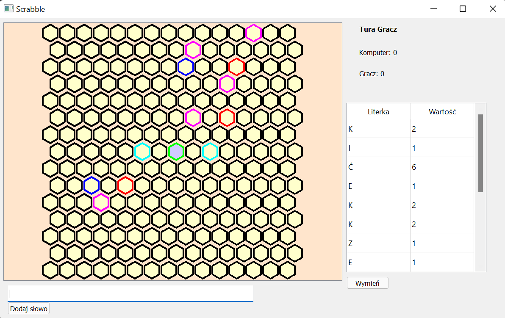
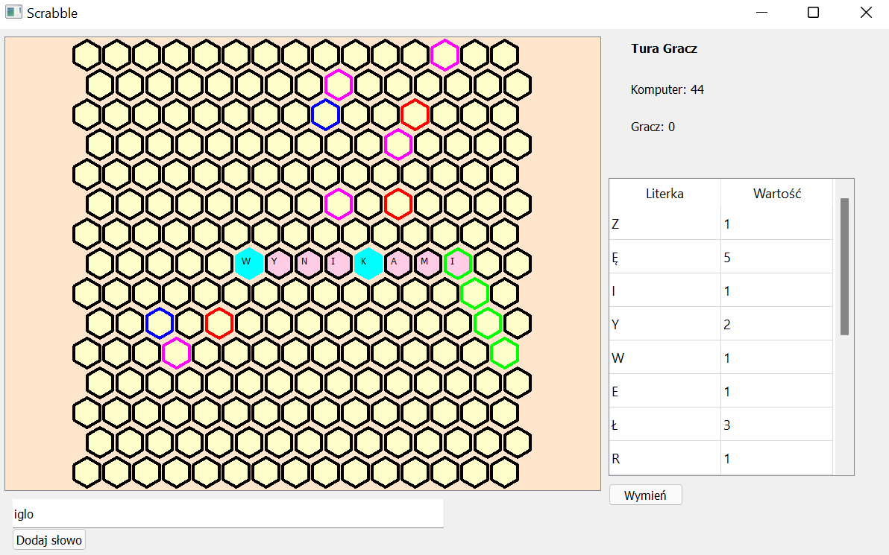

# Hex-Scrabble

## Opis konfiguracji

Plikiem konfiguracyjnym jest plik tekstowy, który składa się z dokładnie sześciu wyrażeń oddzielonych za pomocą znaku nowego wiersza. Kolejność wyrażeń jest ustalona i jest istotna ze względu na sposób czytania konfiguracji przez program.

**Program zakłada poprawność pliku konfigruracyjnego**

Ustalona kolejność:

1. lettercnt = LICZBA_W_RĘCE  
2. bonus2LS = BONUS2L_1, BONUS2L_2, ..., BONUS2L_N   
3. bonus3LS = BONUS3L_1, BONUS3L_2, ..., BONUS3L_N  
4. bonus2WS = BONUS2W_1, BONUS2W_2, ..., BONUS2W_N  
5. bonus3WS = BONUS3W_1, BONUS3W_2, ..., BONUS3W_N  
6. letterfreq = KOSTKA_1, KOSTKA_2, ..., KOSTKA_N  

W powyższych wyrażeniach:

* `LICZBA_W_RĘCE` to liczba całkowita większa od 0 (int) - reprezentuje liczbę liter w ręce graczy. Mimo, że dopuszczamy liczby całkowite większe od 0, aby przeprowadzić dynamiczną rozgrywkę zalecana minimalna LICZBA_W_RĘCE to 5 
* `BONUS2L_i`, `BONUS3L_i`, `BONUS2W_i`, `BONUS3W_i` to krotki liczb całkowitych (int, int) - reprezentują współrzędne premii na planszy (x, y). Premie tego samego typu o innych wartościach bonusu nie powinny mieć tych samych współrzędnych. Jeśli jednak taka sytuacja wystąpi na planszy, na polu będzie zaznaczona bardziej cenna premia. Kiedy natomiast podane współrzędne nie znajdą się na planszy to tracimy premię z tego pola. 
* `KOSTKA_i` to kostka z literką, jej wartością w grze i częstotliwością występowania (str, int, int) w kolejności (literka, wartość, występowanie)

### Uwagi:  
Do poprawności pliku konfiguracyjnego liczą się: kolejność podawania wyrażeń i reprezentacja krotek - konieczna spacja między przecinkiem, a kolejnym elementem w krotce.

Przykładowe pliki konfiguracyjne znajdują się w plikach [konf.txt](./konf.txt) oraz [konf2.txt](./konf2.txt)

## Opis słownika
Plikiem - słownikiem dla komputera jest plik tekstowy z wyrazami oddzielonymi za pomocą znaku nowego wiersza, bądź innym białym znakiem.

Przykładowy słownik znajduje się w pliku [slownik.txt](./slownik.txt)

## Uruchomianie gry 
Niedomyślne biblioteki potrzebne do zainstalowania - PyQt5 i numpy możemy zainstalować za pomocą komendy pip:
```bash
pip install pyqt5
pip install numpy
```

Procedura uruchomienia gry:
```bash
python3 gra_scrabble.py -I <Imię> -S <Słownik> -c <Konfiguracja> -d <Trudność>
```
W celu wyświetlenia pomocy:
```bash
python3 gra_scrabble.py --help
```

## Jak grać?
Po uruchomieniu programu otwiera się okno z grą. To czy zaczyna gracz czy komputer jest losowe.

Okno po uruchomieniu gry wygląda tak:



Jeśli turę zaczyna komputer (oraz w każdej kolejnej turze komputera), to gracz nie ma dostępu do tabelki, pola do wprowadzania tekstu, ani odpowiadającym im przyciskom. Dostęp do powyższych elementów gracz uzyskuje w swojej turze.

To czyja tura informuje pogrubiony napis w prawym górnym rogu okna. Poniżej pola tekstowe informują o tym ile gracz i komputer mają punktów. Te dane w czasie gry będą aktualizowane po każdym ruch komputera, bądź gracza.

Kolejnym elementem okna jest tabela: litera-wartość, w tabeli trzymamy literki, które gracz ma w ręce wraz z odpowiadającymi im wartościami. W przypadku, gdy gracz ma dużo literek obok tabelki pojawia się wygodny suwak do poruszania się do tablicy. 

Za pomocą tabelki możemy wymienić literki w ręce, co spowoduje koniec naszej tury. Aby zaznaczyć literki do wymiany na klawiatrurze przytrzymujemy przycisk *ctrl* i używając kursora myszy wybieramy literki. Wybrane lietrki wymieniamy na losowe z worka naciskając przycisk wymień. Jeśli gracz nie wybierze liter, a naciśnie przycisk wymień to odda swoją turę komputerowi.

Następnie po lewej stronie mamy część z planszą do gry. Na planszy znajdują się pola specjalne i pole start - oznaczenia dotyczące pól na planszy w następnym rodziale. Na planszę słowa dostawiamy zgodnie z regułami gry scrabble, przy czym w układzie heksagonalnym poprawność musi wystąpić w każdym z trzech kierunków zgodnie z zasadą, że czytamy w kierunku od lewej do prawej. Do wpisywania słów służy skrzynka tekstowa poniżej planszy - skrzynka tekstowa akceptuje polskie znaki.

Procedura dodawania słowa na planszę wygląda następująco. Wpisujemy w polu do tego przeznaczonym słowo które chcemy dostawić. Ustawiamy fokus na pole z planszą np. klikając na nią. Na planszy powinny podświeltlić się pola na zielono. To pola, w które program po kliknięciu w przycisk pod skrzynką spróbuje dostawić słowo. Aby ustawić słowo w odpowiednim miejscu używamy strzałek na klawiaturze. Chcąc zmienić kierunek wpisywania słowa należy wcisnąć spację. 

Ilustracja przedstawiająca sytuację przed wciśnięciem przycisku *Dodaj słowo*:


Program sprawdza warunki konieczne do wystawienia dostawki, tzn. czy nie wychodzi poza planszę, nie jest pusta oraz czy z liter z ręki da się ją ułożyć.

Jeśli jest nieprawidłowa, pojawi się okno informujące o błędnej dostawce. Gracz dalej może próbować dostawić słowo. 

**Program zakłada, że gracz jest uczciwy - gracz dostawia uczciwe, istniejące słowa oraz nowe słowa powstające po dostawieniu również są uczciwe**

Tura zmieni się albo po wstawieniu na planszę dobrej dostawki, albo po naciśnięciu *Wymień*.

To gracz decyduje o końcu gry - może to zrobić w swojej turze. Gracz wychodzi z gry naciskając przycisk wyjścia w prawym górnym roku i zamyka okno.

### Uwagi:
Jeśli plansza jest pusta i gracz wykonuje turę to słowo, które dostawia koniecznie musi przechodzić przez pole start, inaczej wyskoczy błąd dostawki.

## Oznaczenia na planszy
Pola wyróżnione na planszy:
 - **pole start** - pole przez które musi przechodzić pierwsza dostawka, na początku dla wyróżnienia wypełnione kolorem **lila**
 - **pole podwójnej premii literowej** - wartość literki na tym polu liczymy dwa razy, puste oznaczone **czerwoną ramką**, pełne całe kolorują się na **czerwono**
 - **pole potrójnej premii literowej** - wartość literki na tym polu liczymy trzy razy, puste oznaczone **granatową ramką**, pełne całe kolorują się na **granatowo**
 - **pole podwójnej premii słownej** - punkty za słowo przechodzące przez literkę na tym polu liczymy dwa razy, puste oznaczone **cyjanową ramką**, pełne całe kolorują się na **cyjanowy**
 - **pole potrójnej premii słownej** - punkty za słowo przechodzące przez literkę na tym polu liczymy dwa razy, puste oznaczone **ramką w kolorze magenta**, pełne całe kolorują się na **magenta**

 ### Uwagi:
Kiedy pola premii są zajęte, nadal są aktywnymi polami premii.

## Opis implementacji

Do uruchomienia gry program używa biblioteki argparse. Tworzony jest parser do którego dodawane są argumenty z terminala. Następnie za pomocą parse_args() dostajemy się do plików, sczytujemy konfigurację. Konfigurację zapisujemy za pomocą słownika.

Za część wizualną gry odpowiada biblioteka PyQt5. Służy ona do tworzenia graficznego interfejsu użytkownika. Dokładna dokumentacja biblioteki PyQt5 pod linkiem: [Link do dokumentacji PyQt5](https://www.riverbankcomputing.com/static/Docs/PyQt5/)

### Jak zaimplementowany jest ruch komputera?

Jedną z opcji jaką gracz ma podczas uruchomienia programu to wybór poziomu trudności. Poziom trudności zależy od czasu jaki ma komputer na znalezienie najlepszej dostawki (moduł time). Poziom ŁATWY - 10s, NORMALNY - 20s, TRUDNY - czas nieograniczony. Komputer szuka najlepszego słowa idąc po słowniku alfabetycznie, zatem gracz wybierający poziom trudny, podczas tury komputera będzie musiał uzbroić się w cierpliwość - komputer będzie szukał dostawki nawet powyżej 2 min w przypadku bardzo dużych słowników i wybierze najlepszą możliwą z całego słownika.

Pewną optymalizacją jest ustawienie współrzędnych liście według klucza:
```bash
WSPÓŁRZĘDNE.sort(key=(lambda p: abs(p[0]) + abs(p[1])))
```
Ponieważ zgodnie z zasadami scrabbli dostawki zaczynamy od startu (współrzędne (0, 0)), to niech komputer idzie po współrzednych od startu po polach z rozsnącą sumą modułów współrzędnych - tam jest największe prawdopodobieństwo, że znajdzie literę do zaczepienia dostawki w ograniczonym czasie.

Jeśli komputer w ograniczonym czasie nie znajdzie dostawki to losuje litery do wymiany. Do tego używamy biblioteki numpy - mamy wygodną opcję losowania bez zwracania.

```bash
import numpy as np
np.random.choice(
            np.array(mojelitery), np.random.randint(1, len(mojelitery) + 1), replace = False
        )
```

Problemem który może napotkać komputer w grze to jest "mała ręka", czyli mała liczba liter dostępnych do ułożenia. Stąd polecenie wyboru liczby liter większej równej 5, w przeciwnym wypadku rozgrywka będzie polegała głównie na losowaniu liter.