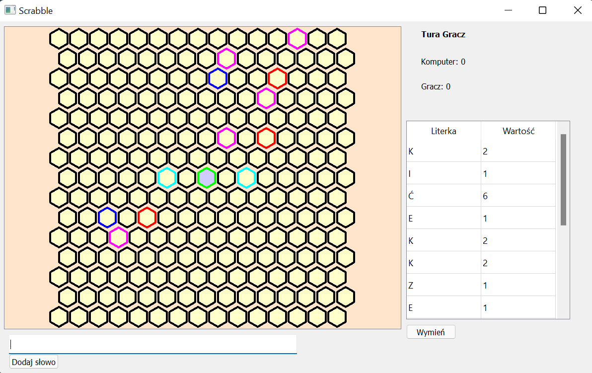

# Opis przyjętego rozwiązania Hex-Scrabble

## Ścieżka wizualizacyjna

Wybrana została ścieżka wizualizacyjna. Do przedstawienia użyto biblioteki graficznej PyQt5, która umożliwiła stworzenie graficznego interfejsu użytkownika. 

## Parametry gry

Korzystając z dopuszczonej w trybie ścieżki wizualizacyjnej możliwości ograniczenia planszy. W rozwiązaniu została przyjęta ustalona plansza 15x15.

Dla urozmaicenia gry pozostawiono premie, których współrzędne podajemy w pliku konfiguracyjnym. Premie są czynne przez cały czas gry. Dokładny opis premii w dokumentacji: [dokumentacja_scrabble.md](./dokumentacja_scrabble.md)

Liczba graczy została ograniczona do dwóch, w tym jednego sztucznego i jednego realnego.

## Gracz sztuczny
Gracz sztuczny (komputer) gra według następującej strategii. W zależności od tego którą z opcji - poziom trudności wybierze gracz komputer ma ograniczony, bądź nie (poziom TRUDNY) czas na przygotowanie najlepszej dostawki. Komputer szukając najlepszego słowa przechodzi alfabetycznie słownik (zaimplenetowany jako lista) - stąd opcja ograniczonego czasu, czas nieograniczony dla dużych słowników, tj. [słownik 100 tys. słów](./slownik.txt) może wydłużyć czas oczekiwania gracza realnego podczas tury komputera nawet do powyżej 2 min.

## Gracz realny
Gracz realny ma do dyspozycji okno gry. W prawym grórnym rogu wyświetlane są informacje dotyczące przebiegu rozgrywki - informacja czyja tura i aktualne wyniki graczy. Poniżej jest tabelka przedstawiająca litery w ręce gracza z możliwością wyboru liter do wymiany realizowanej przez naciśnięcie przycisku *Wymień*. Po lewej stronie mamy planszę do której dostawiamy słowa, po ustawieniu fokusa na planszę za pomocą klawiatury można ustawiać dodawane przez gracza realnego słowa. Pod planszą znajduje się skrzynka tekstowa do której gracz realny wpisuje proponowane dostawki.

Po wciśnięciu przycisku *Dodaj słowo* program doda słowo na planszę w ustawionym miejscu, bądź zwróci informację z oknem błędu ręki lub dostawki. 

**Program zakłada, że gracz realny jest uczciwy.**

Tura gracza realnego mija po dostawieniu dobrej dostawki lub wciśnięciu przycisku *Wymień* (wymienienie 0 liczby liter traktujemy jako oddanie tury).

Gracz kończy grę w swojej turze naciskając przycisk wyjścia w prawym górnym rogu.

Więcej w dokumentacji: [dokumentacja_scrabble.md](./dokumentacja_scrabble.md)

